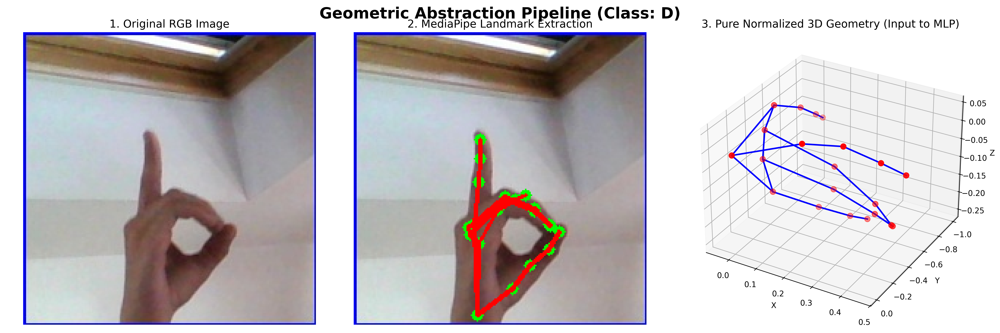
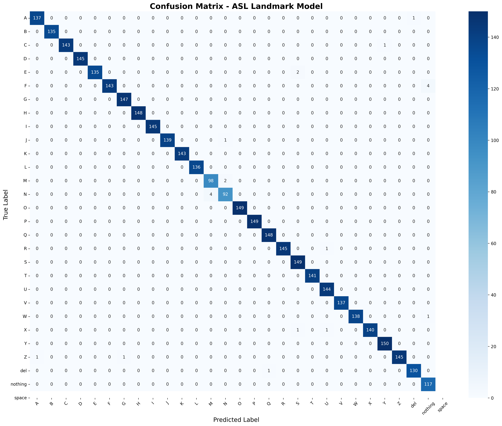
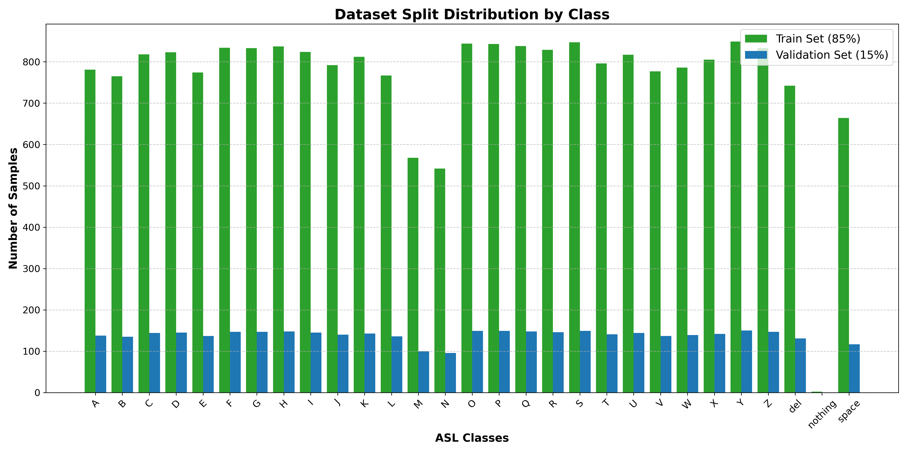

<div align="center">
  
  
  
  
</div>

<h1 align="center">Real-Time American Sign Language (ASL) Recognition System</h1>

<p align="center">
  A highly robust, real-time ASL translator built with <b>MediaPipe Hand Landmarks</b> and a lightweight <b>Multi-Layer Perceptron (MLP)</b>. Designed to be completely invariant to background noise, lighting, and camera distance.
</p>

---

## 🌟 The Domain Gap Problem

Traditional image-based Convolutional Neural Networks (CNNs) often fail when deployed in the real world. Why? Because they learn to rely on the clean, uniform backgrounds found in training datasets. When you turn on your webcam, your room's background clutter, lighting changes, and camera angle completely destroy the CNN's accuracy.

**This project solves the Domain Gap using Geometric Abstraction.**

## 📐 Geometric Abstraction Pipeline

Instead of feeding raw pixels into our neural network, we use Google's **MediaPipe HandLandmarker** to strip away the entire image and extract only the 3D mathematical skeleton of the hand.

<p align="center">
  
</p>

By applying strict mathematical normalizations (wrist-centering and distance scaling) to the 21 extracted landmarks (63 features total), the geometric structure becomes **100% invariant** to:
- Background clutter (furniture, walls, shirts)
- Camera lighting and shadows
- Distance from the camera
- Webcam aspect ratio distortion

---

## 🚀 The MLP Classifier

With the domain gap eliminated, a highly optimized, lightweight Multi-Layer Perceptron (MLP) was trained on the geometric features extracted from the 87,000 images in the Kaggle ASL Alphabet Dataset.

### Evaluation Metrics
The model achieved a stunning **99.43% Validation Accuracy** and compiles down to just a 2.4MB `.keras` file, enabling lightning-fast CPU inference in real-time.

<p align="center">
  
</p>

*The perfect balance of our 85/15 train-test split ensures these metrics are robust across all 29 classes.*
<p align="center">
  
</p>

---

## 💻 Installation & Usage

You can run this translator instantly without having to retrain the model! The repository includes the pre-trained `landmark_model.keras`.

### Prerequisites
Ensure you have Python installed. Then, install the required dependencies:
```bash
pip install tensorflow opencv-contrib-python mediapipe numpy
```

### Running the Translator
```bash
python realtime_translator.py
```

### Controls
Once the webcam window opens:
- Hold up your **right hand** to sign.
- Press `SPACE` to lock in the currently predicted letter to your sentence.
- Press `ENTER` to print the final sentence to your console.
- Press `C` to clear the current sentence.
- Press `Q` or `ESC` to quit the application.

---

## 🧠 Training It Yourself
If you want to tweak the MLP architecture or train it on your own dataset:
1. Download the Kaggle ASL Alphabet Dataset.
2. Run the extraction and training pipeline:
   ```bash
   python train_landmark_model.py
   ```
3. Evaluate your new model:
   ```bash
   python evaluate_landmark_model.py
   ```

## 📝 Project Report
A comprehensive academic project report detailing the dataset, CNN vs MLP architectures, mathematical normalization logic, and results can be found in `MiniProject_ML_nishant.pdf`.
